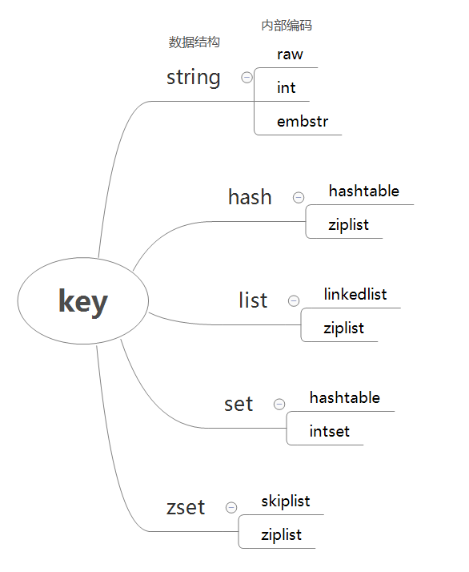

# 全局命令

1. 查看所有键

    keys *

    下面插入了3对字符串类型的键值对：

    ```
    127.0.0.1:6379> set hello world
    OK
    127.0.0.1:6379> set java jedis
    OK
    127.0.0.1:6379> set python redis-py
    OK
    ```

    key *命令会将所有的键输出：

    ```
    127.0.0.1:6379> key *
    1) "python"
    2) "java"
    3) "hello"
    ```

2. 键总数

    dbsize

    下面插入一个列表类型的键值对（值是多个元素组成）：

    ```
    127.0.0.1:6379> rpush mylist a b c d e f g
    (integer) 7
    ```

    dbsize 命令会返回当前数据库中键的总数。例如当前数据库有4个键，分别是
    hello、java、python、mylist，所以dbsize的结果是4：

    ```
    127.0.0.1:6379> dbsize
    (integer) 4
    ```

    dbsize命令在计算键总数时不会遍历所有的键，而是直接获取Redis内置的键总
    数变量，所以dbsize命令的时间复杂度是O(1)。而keys命令会遍历所有键，所
    以它的时间复杂度是O(n),当Redis保存了大量键时，线上环境禁止使用。

3. 检查键是否存在

    exists key

    如果键存在则返回1，不存在则返回0：

    ```
    127.0.0.1:6379> exists java
    (integer) 1
    127.0.0.1:6379> exists not_exists_key
    (integer) 0
    ```

4. 删除键

    del key [key ...]

    del是一个通用命令，无论值是什么数据结构类型，del命令都可以将其删除，
    例如下面将字符串类型的键java和列表类型的键mylist分别删除：

    ```
    127.0.0.1:6379> del java
    (integer) 1
    127.0.0.1:6379> exists java
    (integer) 0
    127.0.0.1:6379> del mylist
    (integer) 1
    127.0.0.1:6379> exists mylist
    (integer) 0
    ```

    返回结果为成功删除键的个数，假设删除一个不存在的键，就会返回0：

    ```
    127.0.0.1:6379> del not_exists_key
    (integer) 0
    ```

    同时del命令可以支持删除多个键：

    ```
    127.0.0.1:6379> set a 1
    OK
    127.0.0.1:6379> set b 2
    OK
    127.0.0.1:6379> set c 3
    OK
    127.0.0.1:6379> del a b c
    (integer) 3
    ```

5. 键过期

    expire key seconds

    Redis支持对键添加过期时间，当超过过期时间后，会自动删除键，例如为键
    hello设置了10秒过期时间：

    ```
    127.0.0.1:6379> set hello world
    OK
    127.0.0.1:6379> expire hello 10
    (integer) 1
    ```

    ttl命令返回键的生育过期时间，它有3中返回值：

    - 大于等于0的整数：键剩余的过期时间。
    - -1：键没设置过期时间。
    - -2：键不存在

    可以通过ttl命令观察键hello的剩余过期时间：

    ```
    # 还剩7秒
    127.0.0.1:6379> ttl hello
    (integer) 7
    ...
    # 还剩1秒
    127.0.0.1:6379> ttl hello
    (integer) 1
    # 返回结果为-2，说明键hello已经被删除
    127.0.0.1:6379> ttl hello
    (integer) -2
    127.0.0.1:6379> get hello
    (nil)
    ```

6. 键的数据结构类型

    type key

    例如键hello是字符串类型，返回结果为string。键mylist是列表类型，返回
    结果为list：

    ```
    127.0.0.1:6379> set a b
    OK
    127.0.0.1:6379> type a
    string
    127.0.0.1:6379> rpush mylist a b c d e f g
    (integer) 7
    127.0.0.1:6379> type mylist
    list
    ```

    如果键不存在，则返回none:

    ```
    127.0.0.1:6379> type not_exists_key
    none
    ```

# 数据结构和内部编码

1. 数据结构和内部编码

    type命令实际返回的就是当前键的数据结构类型，他们分别是：string（字符
    串）、hash（哈希）、list（列表）、set（集合）、zset（有序集合），但
    这些只是Redis 对外的数据结构。

    实际上每种数据结构都有自己底层的内部编码实现，而且是多种实现。

    

    可以看到每种数据结构都有两种以上的内部编码实现，可以通过
    object encoding命令查询内部编码：

    ```
    127.0.0.1:6379> object encoding hello
    "embstr"
    127.0.0.1:6379> object encoding mylist
    "ziplist"
    ```

    可以看到键hello对应值的内部编码是embstr，键mylist对应值的内部编码
    是：ziplist。

    Redis这样设计有两个有好处：第一，可以改进内部编码，而对外的数据结构和
    命令没有影响，这样一旦开发出更优秀的内部编码，无需改动外部数据结构和
    命令，例如Redis3.2提供了quicklist，结合了ziplist和linkedlist两者的
    优势，而列表类型提供了一种更为优秀的内部编码实现，而对外部用户来说基本
    感知不到。第二，多种内部编码实现可以在不同场景下发挥各自优势，例如
    ziplist比较省内存，但是在列表元素比较多的情况下，性能会有所下降，这时
    候Redis会根据配置选项将列表类型的内部实现转换为linkedlist。

# 单线程架构

1. 引出单线程模型

    现在开启了三个redis-cli客户端同事执行命令。
    客户端1设置一个字符串键值对：

    `127.0.0.1:6379> set hello world`

    客户端2对counter做自增操作：

    `127.0.0.1:6379> incr counter`

    客户端3对counter做自增操作：

    `127.0.0.1:6379> incr counter`

    Redis每次客户端调用都经历了发送命令、执行命令、返回结果三个过程。

    其中第2步是重点研究的，因为Redis是单线程来处理命令的，所以一条命令从
    客户端达到服务端不会立刻被执行，所有命令都会进入一个队列中，然后逐个
    被执行。所以上面3个客服端命令执行顺序是不确定的，但是可以确定不会有
    两条命令同时被执行，所以两条incr命令无论怎么执行最终结果都是2，不会产
    生并发问题，这就是Redis单线程的基础模型。但是像发送命令、返回结果、命
    令排队肯定不像描述的这么简单，Redis使用I/O多路复用技术解决I/O问题。

2. 为什么单线程还能这么快

    通常来讲，单线程处理能力要比多线程差，Redis使用单线程模型会达到每秒万
    级别的处理能力原因有三点：

    1. 纯内存访问，Redis将所有数据放在内存中，内存的响应时长大约为100纳
    秒，这是Redis达到每秒万级别访问的重要基础。

    2. 非阻塞I/O，Redis使用epoll作为I/O多路复用技术的实现，再加上Redis
    自身的事件处理模型将epoll中的连接、读写、关闭都转换为时间，不在网络
    I/O上浪费过多的时间。

    3. 单线程避免了线程切换和竞态产生的消耗。既然采用单线程就能达到如此高
    的性能，那么也不失为一种不错的选择，因为单线程能带来几个好处：第一，单
    线程可以简化数据结构和算法的实现。如果对高级编程语言熟悉的读者应该了解
    并发数据结构实现不但困难而且开发测试比较麻烦。第二，单线程避免了线程切
    换和竞态产生的消耗，对于服务端开发来说，锁和线程切换通常是性能杀手。

    但是单线程会有一个问题：对于每个命令的执行时间是有要求的。如果某个命令
    时间执行过长，会造成其他命令的阻塞，对于Redis这种高性能的服务来说是致
    命的，所以Redis是面向快速执行场景的数据库。